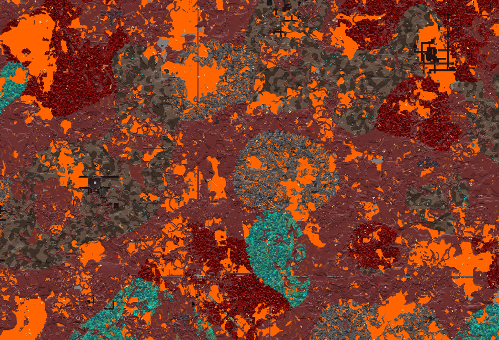
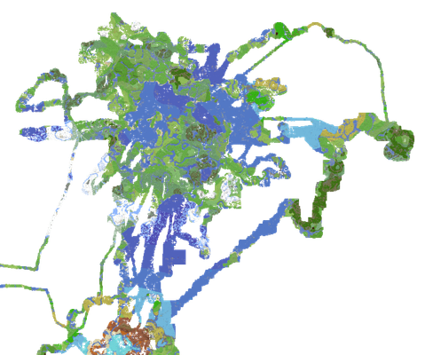
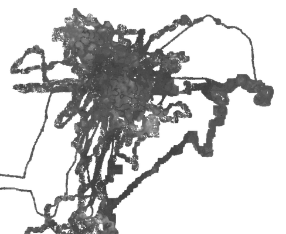
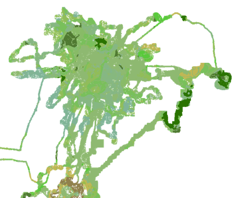
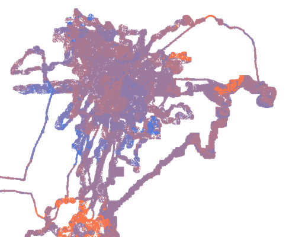
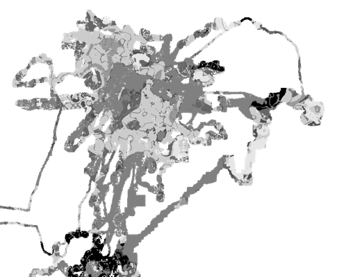
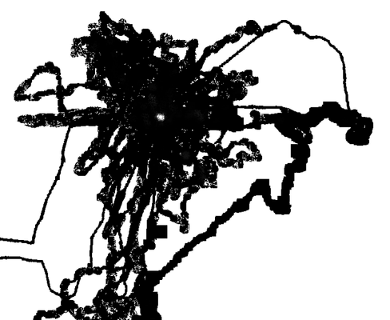

# Chunkmap

A tool to render a top-down view of the loaded chunks in your Minecraft worlds.  
This repository powers [chunkmap.sodiumlabs.xyz](https://chunkmap.sodiumlabs.xyz).




## How to Use

> [!WARNING]
> Chunkmap is currently in beta and has only been tested with Minecraft 1.21.x worlds.  
> Modded worlds are not supported. Chunks generated before 1.18 are not compatible.
> The nether generation is a bit slower than the overworld/end.

Download the CLI from the [releases](https://github.com/sodium-labs/chunkmap/releases) page, or build it yourself with Cargo:

```bash
cargo build --release
```

### Rendering Maps

Render each `.mca` file individually:

```bash
chunkmap-cli render "C:/Users/YOU/AppData/Roaming/.minecraft/saves/WORLD/region" -o ./output -r textures -d overworld
```

Merge all rendered images into a single map:

```bash
chunkmap-cli merge ./output -o map.png
```

### Nether and End Support

The Nether and the End are also supported:

```bash
# Nether
chunkmap-cli render "C:/Users/YOU/AppData/Roaming/.minecraft/saves/WORLD/DIM-1/region" -o ./output -r textures -d nether

# End
chunkmap-cli render "C:/Users/YOU/AppData/Roaming/.minecraft/saves/WORLD/DIM1/region" -o ./output -r textures -d end
```

Other rendering methods are supported. Use the following command to view all options:

```bash
chunkmap-cli render --help
```

## Examples

Below are some examples from one of my worlds. The map is approximately 10,000 blocks wide.

- **Textures** (`-r textures`)

  

- **Heightmap** (`-r heightmap`)

  

- **Biomes** (`-r biomes`)

  

- **Temperature** (`-r temperature`)

  

- **Downfall** (`-r downfall`)

  

- **Inhabited** (`-r inhabited`)

  

## More Information

- `anvil-region` and `chunkmap` are WASM-compatible.
- `blocks.json` and `biomes.json` were generated with [mc-data](https://github.com/sodium-labs/mc-data). Do not edit them manually.
- Go check the [wiki](https://minecraft.wiki/w/Chunk_format) to understand how the chunks are stored.

This repository contains the following projects:

- **anvil-region** – The .mca file parser.
- **chunkmap** – Image generation.
- **chunkmap-cli** – The command-line interface.
- **chunkmap-wasm** – The WASM module used by our website.

### Building the WASM Module

To compile the WASM module, run:

```bash
wasm-pack build --release crates/chunkmap-wasm --target web --out-dir ../../wasm
```

### Building the GitHub release CLI on Windows, for Windows

```bash
cargo build --release --target x86_64-pc-windows-msvc
```
